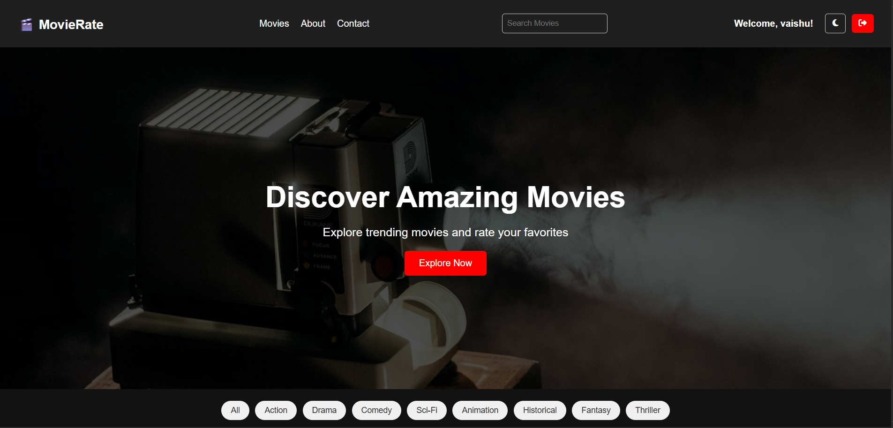
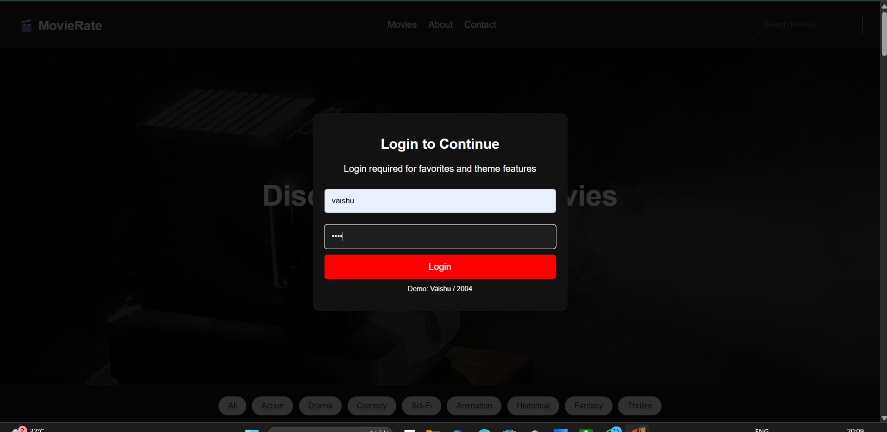
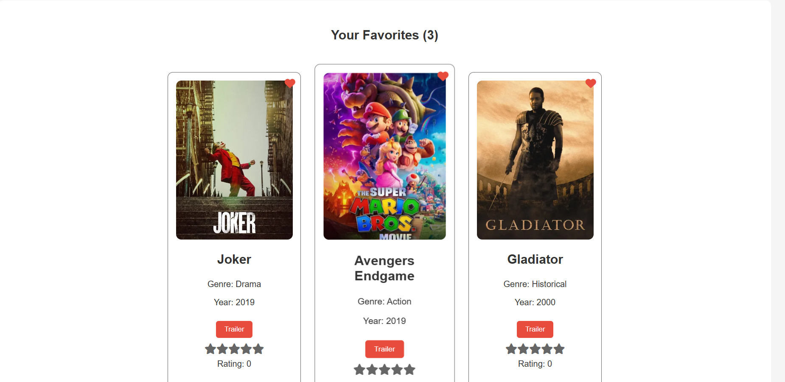
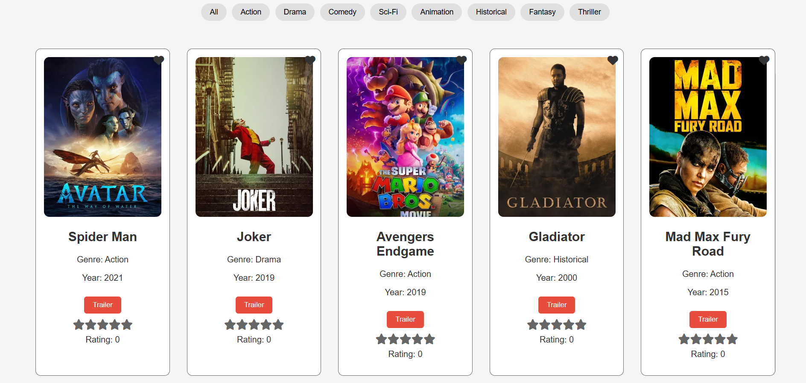

# 🎬 Movie Ranking Website

## 📌 Project Overview
The **Movie Ranking Website** is a responsive web application that allows users to explore, search, and rate movies. It fetches real-time movie data from an external API and provides an interactive user interface for a smooth user experience.

This project focuses on frontend development, API integration, and dynamic UI handling using JavaScript.

---

## 🚀 Live Demo
🔗 https://ctt-vaishnavi.github.io/Movie-ranking-website/

---

## ✨ Features
- 🔍 Real-time movie search functionality  
- 🎯 Filter movies by genre and release year  
- 📊 Sort movies by popularity, rating, and latest release  
- ⭐ Star-based user rating system  
- 📈 Average rating display using LocalStorage  
- ▶️ Watch trailers using YouTube popup modal  
- 📱 Fully responsive (Mobile, Tablet, Desktop)  
- 🎨 Clean UI with animations and hover effects  

---
## 📸 Screenshots  

### 🏠 Home Page  

### 🔍 Login Functionality  

### ⭐ Rating System  

### 🎬 Trailer Popup  

## 🛠️ Tech Stack
- **HTML5** – Structure of the website  
- **CSS3** – Styling and responsive design  
- **JavaScript (Vanilla JS)** – Logic and interactivity  
- **TMDB API** – Fetching movie data and trailers  
- **LocalStorage** – Saving user ratings  

---

## 📂 Project Structure
Movie-ranking-website/ │── index.html │── style.css │── script.js │── assets/ │── README.md
## 🔮 Future Improvements
- Add user authentication  
- Add watchlist feature  
- Improve UI with frameworks like React  
- Backend integration for real-time data storage  

---

## 👨‍💻 Author
**Vaishnavi Shinde**  

---

## ⭐ Support
If you like this project, give it a ⭐ on GitHub!
